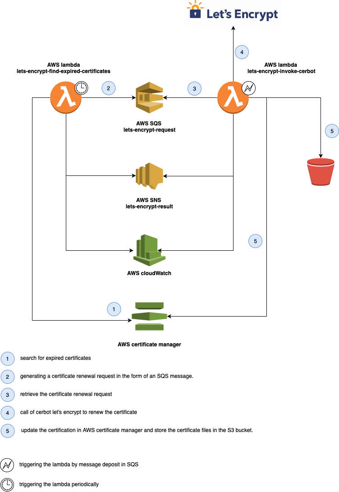

<table>
  <tr>
    <td style="text-align: center; vertical-align: middle;"></td>
    <td style="text-align: center; vertical-align: middle;"></td>
  </tr> 
<table>

# AWS Let's Encrypt Renew certificates

## I - Infrastructure components



## II - Inputs / Outputs

## Inputs

| Name | Description | Type | Default |
|------|-------------|:----:|:-----:|
| aws\_region | aws region to deploy | string | n/a |
| bucket\_name | S3 bucket to receive certificates | string | n/a |
| certbot\_server | The URL of let's Encrypt cerbot server | string | "https://acme-v02.api.letsencrypt.org/directory" |
| cloudwatch\_log\_retention | The cloudwatch log retention ( default 7 days ). | number | 7 |
| function\_timeout | The amount of time your Lambda Functions has to run in seconds Default 90s | number | 90 |
| name | The Number of days before the certificate expires | number | 6 |
| scan\_alarm\_clock | The time between two scan to search for expired certificates ( in minutes default 1440 = 1 days) | number | 1440 |

## Outputs

| Name | Description |
|------|-------------|
| bucket\_arn | The ARN of certificates repository |
| find\_expired\_certificates\_lambda\_arn | The Lambda ARN of Find certificates to refresh by Let's Encrypt |
| invoke\_cerbot\_lambda\_arn | The Lambda ARN of Invoke Let's Encrypt to refresh certificate |
| sns\_result\_arn | The SNS result ARN of topic for result of renew cerificates |
| sqs\_request\_arn | The SQS ARN of queue for request of renew cerificates |

## III - Usage

`````
module "sample"
{

}
`````